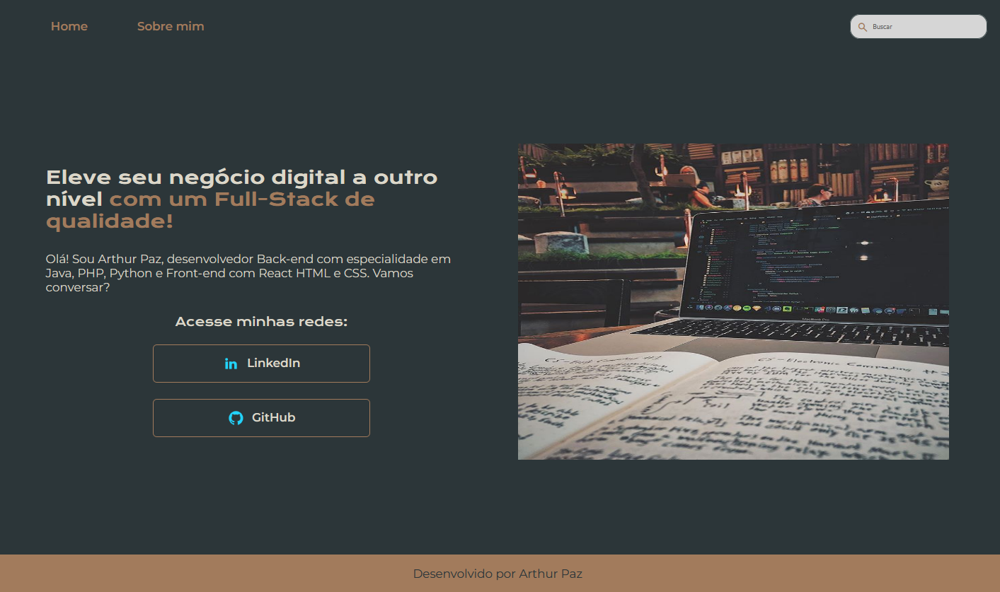

# 🚀 Portfólio de Desenvolvedor - [Arthurpazdev]

Este é o meu portfólio pessoal.

---

### 📸 Demonstração Visual

---

### ✨ Funcionalidades Principais

* **Página Sobre Mim**
* **Design Responsivo**
* **Barra de Busca**

---

### 💻 Tecnologias Utilizadas

* **Front-End:**
    * HTML5
    * CSS3 (com Flexbox e Media Queries)
* **Ferramentas:**
    * Git & GitHub
    * VS Code

---

### 🛠️ Como Visualizar Este Projeto

[Para visualizar este projeto clique aqui
](https://portfolio-eight-delta-11.vercel.app/)

### 👨‍💻 Autor

**Arthur Paz**

* **LinkedIn:**
 [https://www.linkedin.com/in/arthur-boose-paz-0590092b4/](https://www.linkedin.com/in/arthur-boose-paz-0590092b4/)
  
* **GitHub:**
  [@arthurpaz12](https://github.com/arthurpaz12)

---
